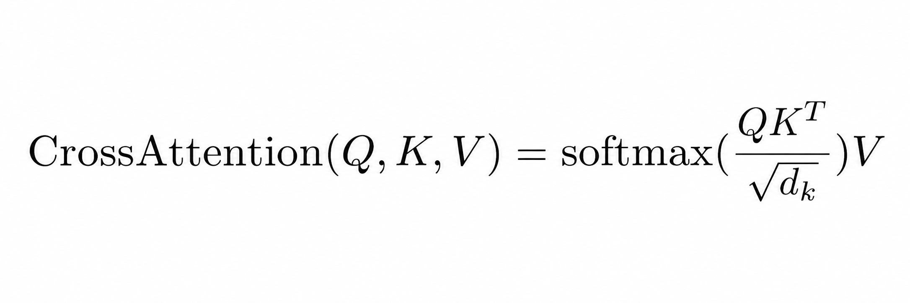

# Self-Attention
### Reference

Vaswani et al. (2017) - "Attention Is All You Need"
https://arxiv.org/abs/1706.03762


### Usage

```python
import torch
from attention.self_attention import SelfAttention

# Create model
model = SelfAttention(input_dim=64)

# Input shape: (batch_size, group, seq_length, input_dim)
x = torch.randn(2, 3, 10, 64)

# Forward pass — returns AttentionOutput(output, attention_weights)
result = model(x)
result.output            # shape: (2, 3, 10, 64)
result.attention_weights # shape: (2, 3, 10, 10)
```


# Cross-Attention

A query sequence attends over a separate key/value source — the standard transformer-decoder pattern where the decoder's hidden states (queries) read from the encoder's outputs (keys and values). Q, K, and V are taken from three independent inputs; the output mirrors the query's shape, while attention weights are `(seq_q, seq_kv)` and need not be square.

### Reference

Vaswani et al. (2017) - "Attention Is All You Need"
https://arxiv.org/abs/1706.03762



### Usage

```python
import torch
from attention.cross_attention import CrossAttention

# Create model — query and key/value sources can have different dims
model = CrossAttention(query_dim=64, kv_dim=32)

# Query, key, value can have different sequence lengths; K and V must share seq length
x_q = torch.randn(2, 10, 64)  # (batch, seq_q,  query_dim)
x_k = torch.randn(2,  7, 32)  # (batch, seq_kv, kv_dim)
x_v = torch.randn(2,  7, 32)  # (batch, seq_kv, kv_dim)

result = model(x_q, x_k, x_v)
result.output            # shape: (2, 10, 64)   — mirrors x_q
result.attention_weights # shape: (2, 10,  7)   — (seq_q, seq_kv)
```


